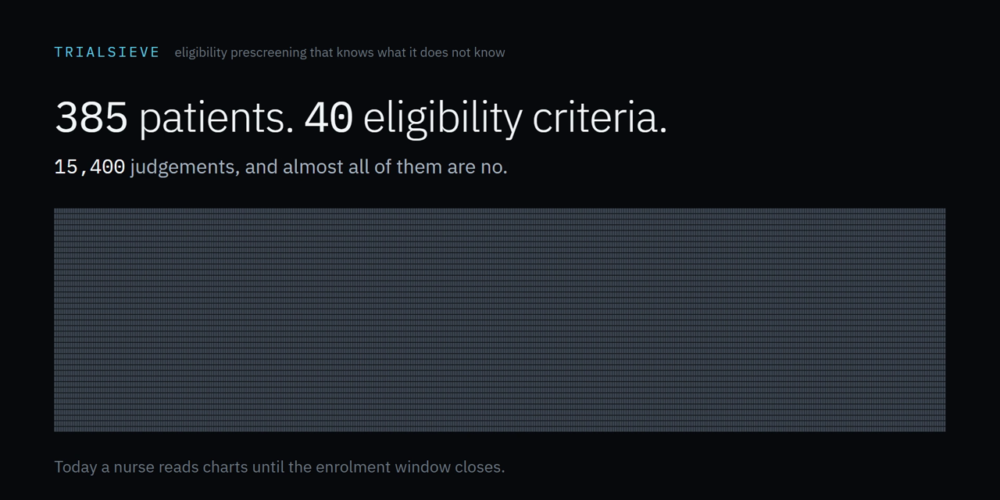
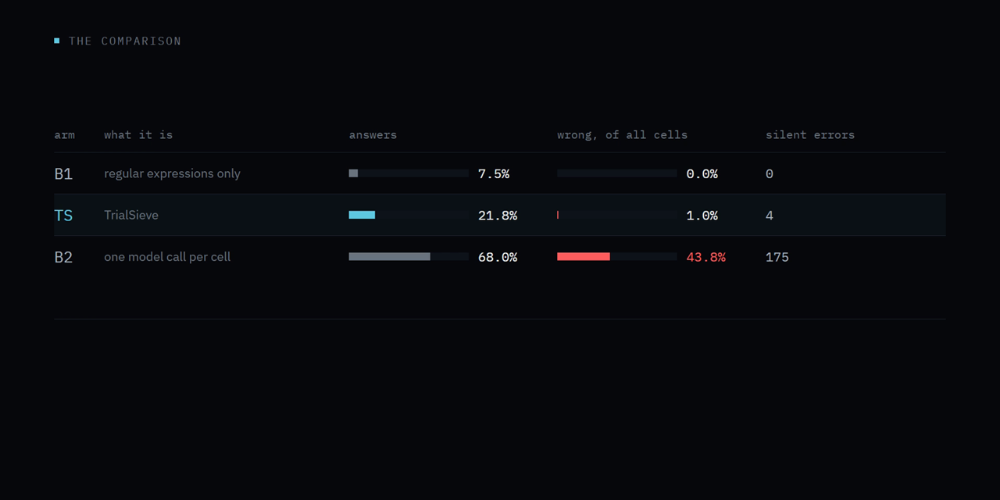
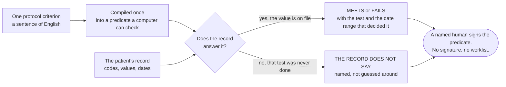
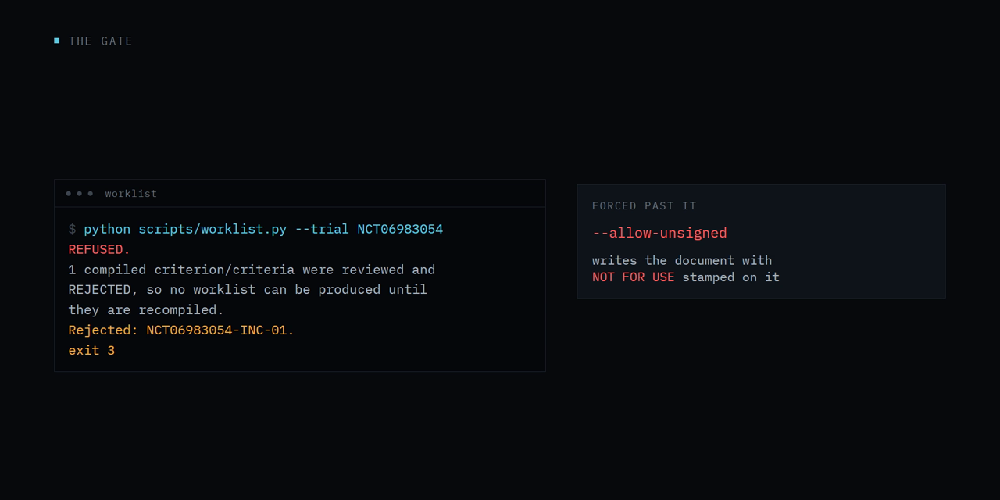
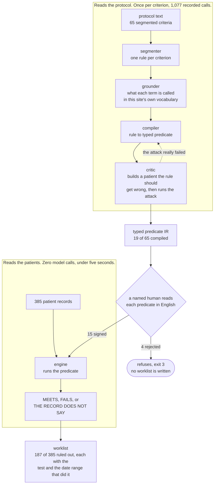

<div align="center">



# TrialSieve

### Eligibility prescreening that knows what it does not know.

**One protocol, 385 candidates, 40 criteria: 15,400 patient-criterion judgements, and
almost all of them are no.** The obvious build asks a model each one. On the same 400
scored cells that arm is **wrong on 43.75% of them with nothing on the page to say so**,
and 145 of those errors say a patient qualifies when they do not. TrialSieve compiles
each criterion into an executable predicate once and then screens with **zero model
calls**: 1.00% wrong, **0 wrong MEETS**, $0.13 per protocol against $22.19 per pass. It
abstains where the record is silent instead of guessing, and it produces no worklist at
all until a named human has signed every predicate.

<table>
<tr>
<td align="center" width="20%"><a href="runs/tierA/cells/"><b>15,400</b></a><br><sub>judgements in<br>one panel</sub></td>
<td align="center" width="20%"><a href="docs/SCORECARD.md"><b>43.75% &rarr; 1.00%</b></a><br><sub>wrong, with nothing<br>on the page to say so</sub></td>
<td align="center" width="20%"><a href="docs/SCORECARD.md"><b>145 &rarr; 0</b></a><br><sub>wrong MEETS, the verdict<br>that enrols the wrong person</sub></td>
<td align="center" width="20%"><a href="docs/COST.md"><b>$22.19 &rarr; $0.13</b></a><br><sub>model spend per panel,<br>then $0.00 to rescreen</sub></td>
<td align="center" width="20%"><a href="https://europepmc.org/articles/PMC4433376"><b>92%</b></a><br><sub>workload cut reported for<br>automated prescreening</sub></td>
</tr>
</table>

[](REPRODUCE.md)
[](tests/)
[](docs/IMPROVEMENT_CHANGELOG.md)
[](runs/tierA/trajectories/index.md)
<br>
[](docs/AGENT_DESIGN.md)
[](docs/EVAL_PROTOCOL.md)
[](docs/GATE.md)
[](docs/EVAL_PROTOCOL.md)
<br>
[](pyproject.toml)
[](requirements-lock.txt)
[](data/vendor/NOTICE)
[](LICENSE)

**[Reproduce it](REPRODUCE.md)** &nbsp;·&nbsp;
**[The comparison](docs/SCORECARD.md)** &nbsp;·&nbsp;
**[Improvement changelog](docs/IMPROVEMENT_CHANGELOG.md)** &nbsp;·&nbsp;
**[Agent trajectories](runs/tierA/trajectories/index.md)** &nbsp;·&nbsp;
**[Every deliverable, mapped](SUBMISSION.md)**

*micro1 Frontier Engineering Challenge · August 2026 · theme: build at the frontier of agentic AI*

</div>

> A wrong exclusion is not a metric. It is a person who never gets offered the trial,
> and nobody re-reads the people who were screened out. **So the interesting number is
> not how many cells an arm answers. It is how many it answers wrongly while looking
> exactly as confident as when it is right.** That number is 43.75% for one model call
> per cell, and 1.00% here.

---

**Reviewing this? Here is each deliverable and the one file that answers it.**

| | |
|---|---|
| Solution code | [`src/trialsieve/`](src/trialsieve/), six agents. Runs offline, no dependencies. |
| Agent instructions, verbatim | [`src/trialsieve/agents/`](src/trialsieve/agents/) as constants, and the first event of every trajectory. Mapped in [docs/AGENT_DESIGN.md](docs/AGENT_DESIGN.md). |
| Improvement changelog | [docs/IMPROVEMENT_CHANGELOG.md](docs/IMPROVEMENT_CHANGELOG.md), 78 entries. Its opening table is the whole arc. |
| Baseline comparison | [docs/SCORECARD.md](docs/SCORECARD.md), one page, four columns. |
| Reproduction guide | [REPRODUCE.md](REPRODUCE.md). One command from a clean clone, 152.3s captured, no key, no network. |
| The video | submitted as a link on the entry form, 4:57 (297.4s of a 300s limit). It is not a file in this repository: it is one of the four deliverables rather than part of the solution, and nothing here needs it to run. |
| Agent trajectories | [runs/tierA/trajectories/index.md](runs/tierA/trajectories/index.md), every model call. Five named exemplars first, then the rest with the failures at the top. The four other arms are indexed the same way beside it. |
| Everything else, and the ground rules | [SUBMISSION.md](SUBMISSION.md), including what existed before this started. |

The main failure mode is in [How it fails](#how-it-fails); the hot take is the
last section.

---

## The result, before the argument for it

The baseline is the obvious build and the brief's own first suggestion: one model
call per patient per criterion. Both arms below ran on **the same 400 cells**,
against the same gold labels, scored by the same script. Four hundred cells is ten
patients against forty criteria, not four hundred people, and the sample is that
small because the baseline is the arm that costs money.

| | one model call per cell | TrialSieve |
|---|---|---|
| **the primary outcome registered before the run** | **VOID** | **VOID** |
| cells answered wrong, with nothing on the page to say so | 43.75% | **1.00%** |
| screens wrongly ruled out, of 30 | 10 | **2** |
| wrong MEETS, the verdict that enrols someone who should not be | 145 | **0** |
| model spend per 385-patient panel | $22.19 | **$0.13**, then $0.00 to rescreen |
| cells it answers at all | 68.00% | 21.75% |

<div align="center">

</div>

| cells resolved correctly per screen, the registered co-primary | **3.23** | 2.77 |

**Read the first row first.** The primary outcome was registered before the run
as panel reduction at zero false exclusions, and it reads VOID at any non-zero
count, so an arm that wrongly rules out two screens fails it exactly as one that
rules out ten does. Neither arm passes. Everything below that row is what
happened behind it.

The last two rows are losses and they are here for that reason. TrialSieve
abstains three times as often, and a guard registered before the first run
specifically so that an arm could not win by abstaining finds against it by 17%.
The false-exclusion row has a 95% interval that includes zero, so ten against two
is what this run did and not a difference this evaluation can separate from
chance. [docs/SCORECARD.md](docs/SCORECARD.md) carries every row with its
uncertainty beside it, and the reduction each arm did reach behind the void.

What that buys: the 43.75% number is the one a coordinator cannot audit. A wrong
answer that looks like a right answer costs a chart re-read to find, which is the
work the tool was bought to remove. TrialSieve says *the record does not say*
instead, and the residue it leaves is grouped by question rather than by patient.

---

## What it decides, in one picture

Six agents read the protocol. None of them reads a patient. What screens the panel is
the compiled predicate, and its third answer is the one this project is about.



A per-cell model has no third branch. Asked whether a kidney test is under thirty when
the test was never done, it answers anyway, and the answer reads exactly like the ones
that are right.

<div align="center">

</div>

## Where everything is

**What decides a patient**

| | |
| --- | --- |
| [`src/trialsieve/`](src/trialsieve) | 20 files. Six agents, the compiler, and the evaluator that screens with no model in it |
| [`src/trialsieve/agents/`](src/trialsieve/agents) | 6 files. Each agent's instructions, as versioned string constants, verbatim |
| [`scripts/`](scripts) | 27 files. One runnable step each, plus the sign-off gate and the replay verifier |

**What the numbers rest on**

| | |
| --- | --- |
| [`runs/`](runs) | 2,398 files. Every scored cell, every compiled predicate, every recorded model call |
| [`runs/tierA/trajectories/`](runs/tierA/trajectories) | 471 files. One per model call, readable from the instructions through to the result |
| [`results/`](results) | 11 files. The published numbers, and the prompt digest that invalidates them |
| [`evaluation/`](evaluation) | 11 files. The gold labels, the scoring, and the second labeller |

**What you read**

| | |
| --- | --- |
| [`docs/`](docs) | 18 files. The changelog, the scorecard, the registered protocol, the gate |
| [`REPRODUCE.md`](REPRODUCE.md) | One command from a clean clone. No key, no network, no cost |
| [`SUBMISSION.md`](SUBMISSION.md) | Every deliverable mapped to the file that answers it |

**What stops it drifting**

| | |
| --- | --- |
| [`tests/`](tests) | 57 files, 400 tests. Including the ones that fail this README when a figure moves |
| [`data/`](data) | 14 files. Synthea and ClinicalTrials.gov, with the licence notice and pinned digests |

Also tracked: [`.github/`](.github), [`tools/`](tools), and the eleven files at the root.

## Who this is for, and what it is

**The user is the clinical research coordinator at a trial site.** They are handed
a protocol and a panel of candidate patients, and they decide who is worth
screening in person. Nobody else in the process reads every criterion against every
chart, and nobody re-reads the people they rule out.

TrialSieve turns that panel into a ranked worklist: the provably ineligible are
removed with a dated citation each, and everyone else is ordered by how few
questions remain.

The bottleneck is not the individual chart. Reading one chart against one criterion
is not the slow step, and this project never timed it, so it puts no number on it.
The slow step is that the list is longer than the reading capacity, so candidates
get worked in whatever order the list arrives in.

That is this project's premise, not one of its findings. No coordinator was
observed here. It is measured elsewhere: Ni et al., *Automated clinical trial
eligibility prescreening*, JAMIA 22(1):166-178, 2015
([PMC4433376](https://europepmc.org/articles/PMC4433376),
doi:10.1136/amiajnl-2014-002887) ran automated prescreening against a
physician-generated gold standard across 13 trials and 202,795
emergency-department patients and reports "the workload with automated ES was
reduced by 92% on the gold standard set". Different quantity, different
population, cited for the premise and not as a bar this project clears. If the
premise is wrong, the numbers here are still what they say they are. They would
simply matter less.

What is measured here is the grid: 385 Synthea patients against a held-out
40-criterion protocol, 15,400 patient-criterion cells. `results/RESULTS.md`
reports what fraction of it the system settles and how many of the settled cells
it gets wrong. The second number is the one that decides whether the first is
worth anything.

**And what is left is shaped like questions, not like patients.** On the published
worklist (one trial, the zero-false-exclusion operating point) the engine settles
187 of 385 screens and clears 8 to contact. The 190 still open carry **two distinct
questions** between them, and 188 are open on the same one: no HbA1c on file. So a
coordinator has one thing to go and find rather than 190 charts to read. Getting it
still returns 188 separate values. What collapses is the search, not the answers.
That follows from compiling once instead of asking per cell: a predicate fails the
same way for everyone it fails for, so its residue sorts into questions, while a
per-cell model answers each patient separately and leaves a residue that sorts into
patients with nothing to group. The counts are generated into
[docs/COST.md](docs/COST.md) from
[docs/sample_worklist.json](docs/sample_worklist.json), which states what does and
does not generalise from one trial.

The job is to shrink the list **without a single false exclusion**. That constraint
is why the interesting number here is not accuracy. A system that removes nobody is
safe and useless; a system that removes the wrong person has done the one harm
prescreening can do. Coverage and silent error are reported as a pair for that
reason, and neither is reported alone.

---

## What it costs, and what that number is not an argument about

| 385 patients, 40 criteria, 15,400 judgements | today | TrialSieve |
|---|---|---|
| model spend per screening pass, at an illustrative hosted rate | $22.19, asking per cell | **$0.13**, paid once per protocol |
| the same panel rescreened next month | $22.19 again | **$0.00**, the predicates are already compiled |
| wall clock for the pass | a nurse reading charts | under 5 seconds, zero model calls |
| what a coordinator is handed *(one trial, the 3 criteria the zero-false-exclusion operating point applies, so 1,155 of those judgements)* | 1,155 chart readings | 190 screens carrying 2 open questions, [grouped](docs/sample_worklist.md) |

Each row names the set it is counted over, because they are not the same set: the
cost rows are the whole 15,400-cell panel and the last row is one trial at one
operating point. Every money figure is read back out of
[docs/COST.md](docs/COST.md) by `tests/test_readme_cost_claims.py`. The two costs
cross at 2.2 patients, and past that the gap grows with every patient and every
rescreen, because one side of it is flat.

**The larger cost is not in that table, and it is a person.** Before this produces
any document, somebody qualified reads all 19 compiled predicates and signs them.
No clinician was timed here, so this repository does not put a rate on it. What it
can do is give you the quantity, measured rather than guessed: **19 predicates,
1,478 words in total** across their source text, expression, unit note and absence
note. Median 60 words each, longest 262. Price that at your own reviewer's rate.

Against the per-cell baseline that is the whole argument, because the baseline has
no reviewable artifact at all. To get the same assurance you would read 15,400
individual answers, and read them again next month. What compiling buys is not a
smaller bill. It is a review surface small enough that reviewing it is possible.

**And the cost table above is not the argument against the tool a site already
owns.** i2b2, ATLAS, TriNetX and the EHR query builders cost nothing more to run,
so on price they win and this table is beside the point. The case against them is
in [Prior art](#prior-art) and it is not about money: a filter cannot tell you who
it could not decide, and the patients it silently drops are the ones this project
exists to count. If price is what decides, buy neither; the incumbent is free.

---

## What a per-cell model does with a missing lab

The criterion is from a real registered trial:

> Urine albumin-to-creatinine ratio below 30 mg/mmol.

In this panel, 359 of 385 patients have no UACR result at all, so a record with
nothing to compare against is the normal case rather than an unlucky one.

Ask a capable model directly, one cell at a time, giving it the criterion and the
patient's chart. Over all 400 cells of that arm it **commits to a verdict on 272
of them**, 68%, including cells where the record is silent. Nothing in the chart
contradicts the threshold, so the threshold appears satisfied. The reasoning is
fluent and the answer is confident, and on those same 400 cells it is wrong on
43.75% of every cell against TrialSieve's 1.00%. Counted only over the cells each
one answers, that is 175 of 272 for the baseline and 4 of 87 here.

**Almost all of that gap is one thing, and it is not better reading.** Split the
same 400 cells by whether an answer exists. On the 105 where gold is MEETS or
FAILS, the baseline is the *more* accurate arm: 2.0% wrong against 4.6% of what
each answered. The entire difference sits in the 295 cells where the record does
not say, where the baseline commits on 173 and this system commits on none. So
what the design buys is abstention discipline, which is a narrower claim than the
headline pair invites. That split is in `results/RESULTS.md` under *The k = 0
gap*, and it is there because `docs/EVAL_PROTOCOL.md` registered before the run
that a large gap would be investigated rather than reported.

**And gold was written by the person who wrote the system.** There was no
independent clinical annotator, and neither labeller is a trial coordinator. That
biases toward this system looking correct, which is why a second labeller reads
the criterion prose alone on a different model family, and why the rate at which
the two disagree is published as a floor
([below](#evaluation)). Read every number as agreement with two readings of the
protocol text, one of them the author's, rather than with a clinician.

**Read that pair with its sample size.** Those 400 cells are **10 patients**
against 40 criteria, not 400 people. Ten is what the arm costs: $22.19 for a full
pass, which is the number the cost section is about. The 15,400-cell grid the rest
of this repository is scored on runs no per-cell model arm at all, so the 43.8%
figure does not appear there and nothing in this README claims it does. The
degenerate controls `B0` and `B1` do run on the full grid, and they are weaker
comparisons than B2, which is said here rather than left to be noticed.

TrialSieve answers:

```
INDETERMINATE
  no observation with code 14959-1 in the record
```

The difference is not accuracy on a hard case. It is that one of these systems
abstains as a rule and the other abstains as an exception: the baseline is told
to answer INDETERMINATE and shown how, and still commits on two thirds of its
cells. A coordinator reading the
first output has no way to tell it apart from a real result, and the patient it
concerns is quietly dropped from consideration by a fact that was never there.

That failure is silent by construction: nobody audits the people who were screened
out, because nobody looks at them again.

**The worked pair is generated, not written, and it is not cherry-picked.**
`python scripts/counterexample.py` runs both arms on one patient and writes the
transcript to [docs/COUNTEREXAMPLE.md](docs/COUNTEREXAMPLE.md), using the same
baseline code path the evaluation scores. On the patient it picks, the baseline
abstained too, and the document says so rather than hiding it. That is the point
of publishing the rate instead of the anecdote: the failure is not that the model
is always wrong, it is that it cannot tell you when it does not know, and two
thirds of the time it does not tell you.

---

## The architecture, and why it is shaped this way

The obvious build puts the chart and the criteria in one prompt and asks for
verdicts. It is fast and it is wrong in a specific direction: it collapses "the
record does not say" into a verdict, and the output gives a reader no way to tell
which is which.

TrialSieve splits the problem at the point where the work is reusable:

The split is the argument, so here it is with the model calls on one side of it
and the patients on the other.



Everything above the sign-off happens once and is reviewable in an afternoon.
Everything below it happens 15,400 times and involves no model at all. The arrow
that matters is the one that is missing: no patient record ever reaches the top
box.

**The scored pipeline starts at the compiler, not at the segmenter.** The
segmenter runs and its output is measured in `docs/SEGMENTATION.md`, but the
criterion set every arm is scored on is hand-authored, in
`evaluation/gold/criteria_set.py`, so that arms are compared on verdicts rather
than on how each of them happened to cut the protocol into pieces. That choice
costs something and the cost is published: the segmenter produced 65 criteria
across the three trials and the gold set keeps 40, so coverage is reported against
both denominators in `results/RESULTS.md` and the registered one is 65.

**Compilation happens once per criterion. Execution happens once per patient and
calls no model at all.** Three things follow.

1. Every verdict is a predicate plus the dated resources it read. It is citable
   down to a FHIR resource id.
2. Adding a patient costs arithmetic. A bigger panel makes the economics better,
   not worse.
3. A human reviews the model's clinical judgement **once per criterion**, not once
   per patient per criterion. Sign-off scales with the protocol, which has about
   forty criteria, not with the queue, which has 385 people.

### The agents

| agent | job | model calls |
|---|---|---|
| `segmenter` | criteria blob to atomic, typed criteria | 1 per trial |
| `grounder` | clinical concept to codes in this site's vocabulary, or **UNMAPPABLE** | 2 per concept (expand, then select), cached across criteria |
| `compiler` | criterion prose to predicate IR, with a bounded repair loop | 2 per criterion |
| `critic` | build a patient the predicate gets wrong, then run it | 1 per criterion, plus 1 revision |
| `adjudicator` | execute predicates over the panel | **0** |
| `worklist` | rank and render what the coordinator opens | 0 |

The interesting row is the one with a zero in it. Everything downstream of the
compiler is deterministic, replayable and free.

### Three-valued logic, all the way down

The engine evaluates in Kleene's K3: TRUE, FALSE, UNKNOWN. `FALSE` dominates
conjunction, `TRUE` dominates disjunction, and UNKNOWN propagates otherwise. So a
patient with one proven disqualifier is ruled out even with ten questions still
open, and a patient with ten unknowns and no proven disqualifier is never ruled out
at all.

Two rules the code enforces rather than requests:

- **Absence is a modelled decision, not a default.** Every query into the record
  declares `absent_means` as `false` (this domain is trusted complete for these
  codes) or `unknown` (silence proves nothing). Under `unknown` a missing
  measurement returns INDETERMINATE and rules nobody out. Under `false` it
  returns FAILS, and the evidence it cites is an absence marker rather than a
  dated resource.
- **So absence can rule someone out, and that is the sharp edge of this design.**
  An earlier version of this file said absence never rules anyone out. The code says otherwise (`src/trialsieve/evaluator.py:233`) and so did the first
published run: one criterion compiled with `absent_means: "false"` produced 358
of the 424 wrong FAILS in the whole evaluation. The control that was supposed to catch it
  is the human reading the predicate in English before any worklist exists, and
  on that run it was not caught.
- **One case is no longer the model's to decide.** A query with an empty `codes`
  list is asking about a concept this site has no code for, so the record could
  never have stored it and its silence carries no information. The compiler now
  forces `absent_means` to `unknown` there and records the change on the
  trajectory as a `normalisation`. Silent errors fell from 469 to **111** and
  patients wrongly ruled out from 182 to **18**, at a cost of 5 points of
  coverage. Entry 30 of the changelog puts the gain and the cost in the same table, before
and after, and [docs/SCORECARD.md](docs/SCORECARD.md) puts the coverage cost
next to the baseline's.
- **Every other closed-world decision is still the model's, and the sensitivity
  arm is how you check it.** `--absent-means-override unknown` discards all of
  them at once. It used to remove 358 silent errors, taking 469 down to 111. It
  now removes **zero**: both arms report 111, so what is left has nothing to do
  with absence. The targeted repair reached the same error floor as the blanket
  override while answering more cells, 19.15% against 18.44%. A gap re-opening
  there means a new closed-world assertion started committing.

### A code can contain a concept without establishing it

A site codes at whatever grain it was built for, and it is rarely the grain a
protocol asks for. The one anaemia code in this corpus is unqualified, so a
criterion about iron deficiency anaemia meets a code that contains the answer
without giving it.

Both obvious handlings are wrong. Treat the coarse code as a match and you
manufacture MEETS verdicts the record cannot support. Call the concept unmappable
and you discard the half of the information that is real, which is the half that
removes people from the list.

So a query carries `broader_codes` beside `codes`, and they are read
asymmetrically:

| the record holds | verdict |
|---|---|
| a code from `codes` | TRUE |
| a code from `broader_codes` | UNKNOWN, naming the code and saying the site does not draw the distinction |
| neither | whatever `absent_means` says, unchanged |

Presence cannot settle it. Absence still can.

That is what the design promises, and the run this repository published first
broke it twice. The project found out by checking rather than by claiming. The
compiler's emit validator accepted any code the grounder returned, from either
slot, because it was written to catch invented codes and does that correctly. It
could not see a real code put in the wrong slot. Two criteria out of the eight
with broader-only grounding promoted SNOMED 44054006 into `codes`, and both also
carried `absent_means: false`, so presence settled them as MEETS and absence as
FAILS, and neither could return INDETERMINATE. One of the two was the criterion behind the 358 wrong exclusions above.

The validator is now slot-aware and the schema accepts the shape the design asks
for, which it had been rejecting. `python scripts/grounding_audit.py --run
runs/tierA` exits 0 and reports 9 criteria grounding a broader-only code with
**0** used as an exact code. `tests/test_grounding_audit.py` holds that at zero
and requires the audit to have scanned a non-empty set, so a clean result cannot
come from reading nothing. Entries 25, 27 and 29 of the improvement changelog
have the mechanism, the repair, and the intermediate state where fixing it made
every headline number worse.

### UNMAPPABLE is load-bearing

This corpus contains no SGLT2 inhibitor, GLP-1 receptor agonist, DPP-4 inhibitor,
thiazolidinedione or sulfonylurea codes. Only metformin and insulin.

A grounder that maps "SGLT2 inhibitor" to an empty code list and then applies
closed-world logic clears every patient on that exclusion criterion, confidently
and wrongly. So a concept with no code in the site's vocabulary makes the criterion
non-compilable and routes it to a human, rather than flowing through as an
absence.

## What a coordinator gets

A worklist that recommends nobody. It removes the provably ineligible with evidence,
ranks the rest by how little is left to check, and for each patient it cannot settle
it names the record entry it could not find, under the criterion that entry blocks:
`no observation with code 4548-4 in the record`, against `HbA1c 6.5-10%`. That is a
statement about the chart, not a question addressed to anyone, and calling it a
question would be the overclaim this repository keeps catching itself in. It ends by saying what it did **not** settle: this
trial has 15 criteria, the document answers 3, and the other 12 are still the
coordinator's on every patient it hands back, with the six the compiler refused
listed and its reason beside each one.

Three files, same run, same provenance header:
[docs/sample_worklist.md](docs/sample_worklist.md) to read,
[docs/sample_worklist.json](docs/sample_worklist.json) with the evidence behind
every decision rather than the first 25, and
[docs/sample_worklist.csv](docs/sample_worklist.csv), 1,155 rows of one patient per
criterion, which is the form a screening log or a CTMS takes.

No document that could reach a coordinator can be produced from predicates a named
human has not read and signed. The gate stops the artifact, not the arithmetic:

```bash
python scripts/signoff.py --run runs/tierA --reviewer "..." --role "..."
```

That has been done here, and it is why the sample above carries a banner: of the
nineteen compiled predicates, four were rejected, so the gate is closed and the
document only exists under `--allow-unsigned`. What the reviewer refused, in their
own words, is in [docs/GATE.md](docs/GATE.md#3-signed).

The signature is over the predicate digest, so recompiling invalidates it. There is
no `--approve-all`, because a gate you can clear without reading is not a gate.
Evaluation runs execute the same predicates and are exempt, and say so where they
are scored: measuring your own error rate affects nobody.

## Reproducing it

```bash
python -m pip install pytest      # the only install
python run.py reproduce           # offline, no API key, no model
```

That one command runs all three arms. If you want them separately, the brief asks
for the solution, the baseline and the evaluation as distinct commands, and they
are:

```bash
python scripts/compile_protocol.py --run runs/tierA --mode replay --provider shim --seed 7
python scripts/run_arms.py --run runs/tierA --mode replay --arms TS,B0,B1 --seed 7
python scripts/run_arms.py --run runs/tierA --mode replay --arms B2 --patients 10 --tag b2_10p --model gemini-3.7-flash-medium
python scripts/report.py --run runs/tierA --out results
```

The first two are the solution, the third is the per-cell baseline it is measured
against, and the fourth scores both. [REPRODUCE.md](REPRODUCE.md#the-solution-the-baseline-and-the-evaluation-as-three-separate-commands)
says what each one reads and writes.

Zero runtime dependencies: every import in `src/`, `evaluation/`, `scripts/` and
`tools/` is standard library, and `tests/test_dependencies.py` fails if that stops
being true. The video build is the one exception and is not on this path. Full
guide, including what each verification step rules out:
[REPRODUCE.md](REPRODUCE.md).

The recorded model calls are cassettes keyed on the sha256 of the full canonical
request. `python scripts/verify.py prove-replay` adds one space to one prompt and
shows the run stop with `CassetteMiss` rather than return the previous answer.
`prove-sensitivity` edits one recorded predicate and shows a published number move.
Together they say the recordings are load-bearing and tamper-evident.

## Evaluation

The protocol was pre-registered and committed before the first scored run, with
predictions written down so that being wrong is visible:
[docs/EVAL_PROTOCOL.md](docs/EVAL_PROTOCOL.md).

Two things about it are worth knowing before the numbers:

**The corpus cannot show the failure mode on its own.** Synthea records are complete
by construction, so absence-of-evidence barely occurs naturally and any silent error
rate measured on raw Synthea is a lower bound. A degradation harness induces it:
drop k% of criterion-relevant observations, flip a stored unit to a plausible
alternative, strip a date a window depends on, downgrade a coded condition to text.
Results are a curve over k, not a number. Real missingness is not random and
correlates with fragmented care and sicker patients, which is exactly what this
harness cannot reproduce.

**Gold has two independent routes.** Checker A is hand-authored predicates that
share no execution code with the engine. Checker B labels from criterion prose and
a flattened patient table only, on a different model family, with no sight of the
IR, of A, or of any system output. The pre-adjudication disagreement between them is
published as the label noise floor, and any measured difference smaller than that
floor is reported as uninterpretable rather than as a finding.

Results, the improvement history, and the trajectories:

- **The comparison against the baseline**, four columns and one page:
  [docs/SCORECARD.md](docs/SCORECARD.md). Start here. Every number in it is read
  out of `results/results.json`.
- **The Improvement Changelog**, 78 entries, each naming the evidence that found
  it and what moved afterwards:
  [docs/IMPROVEMENT_CHANGELOG.md](docs/IMPROVEMENT_CHANGELOG.md). Its opening
  table is the whole arc in one screen, baseline to final.
- **The agent instructions**, verbatim: the prompt constants live beside the code
  in [src/trialsieve/agents/](src/trialsieve/agents/), tagged with the
  `PROMPT_VERSION` each run recorded, and the same text appears as the first
  `instructions` event of every file under
  [runs/tierA/trajectories/](runs/tierA/trajectories/index.md).
- Every model call, sorted failures first:
  [runs/tierA/trajectories/index.md](runs/tierA/trajectories/index.md)
- The full generated report:
  [results/RESULTS.md](results/RESULTS.md), generated by `scripts/report.py`
- [docs/CONTAMINATION.md](docs/CONTAMINATION.md), generated by `scripts/contamination.py`

### Did the model read these trials, or remember them?

Three registered trials with public identifiers is exactly the setup where a
result can be produced by recall. A model that saw NCT06983054 in training can
emit its thresholds without the criterion in front of it, and every number would
still be right, and the evaluation would be measuring memorisation.

Three checks, and the third is the one worth arguing with. A threshold is changed
to a value the real protocol never contained, the criterion is recompiled, and the
predicate has to carry the new number. **15 criteria carried a perturbable
number. Six recompiled, and 6 of 6 carry the perturbed value with none carrying
the original.** Two refused, for concepts absent from the structured record at
all, menstrual history and dietary sodium intake, which is the same refusal they
give unperturbed. The remaining seven could not be run: their counterfactual
compile was never recorded, and replay refuses to make a live call rather than
quietly paying for one, so `results/contamination.json` marks them `error` with
the missing cassette key. Seven of fifteen unrun is the honest size of this
check, and it is a smaller check than the number 6 of 6 suggests on its own.

The first two checks are cheaper and run without a model: no prompt template has a
slot for a trial identifier or title, and no recorded request contains one. That
scan subtracts every word sequence the system is legitimately given, because
"chronic kidney disease" is in one of these titles and in half the criteria, and a
check that fires on the disease name can only ever return positive.

## Prior art

Criteria2Query, TrialGPT, RECTIFIER, and the CHIP 2025 shared task all attack
criteria-to-structured-query. HL7 CQL is the standards-track answer to executable
clinical logic, and it already has three-valued null semantics, so a third truth
value is not the novelty here and this file should not have implied it was.

**The thing to compare against is not a paper, it is the cohort tool the site
already owns.** i2b2, OMOP with ATLAS, TriNetX, and the query builders inside the
major EHRs all filter a population on structured fields, they are already connected
to real data inside an approved pathway, and they cost nothing more to run. On the
criteria this system actually compiles, mostly lab values and demographics, they do
the same job. Any honest reading has to start there.

What a filter cannot do is tell you who it could not decide. A patient with no
HbA1c on file does not match `HbA1c between 6.5 and 10`, so they leave the panel
without appearing anywhere, and nobody re-reads them. That is the same silent
exclusion this project spends its evaluation measuring, except it happens by
default rather than by decision.

The measured prior result is Ni et al. above: 92% workload reduction against a
physician gold standard, with mean average precision 62.9%. It is the number this
work should be read next to and it is not the number this work reports, because the
two are not the same quantity. That paper reduces the pool a person must screen and
is scored on how well the retained pool matches a physician's picks. This one
removes patients outright with a citation and is scored on how many of those
removals a label says were wrong: 46.15% panel reduction with 18 false exclusions,
registered as VOID, and 43.5% with none on the nine criteria that never produce
one. A reduction figure and a reduction-with-a-zero-false-exclusion-constraint
figure are not interchangeable, and quoting one against the other would be the
comparison this repository spends its evaluation section refusing to make.

So the difference is not the compilation step, which is well trodden. It is three
things. Absence is a per-query decision that a human signs, rather than a property
of the query language nobody was asked about. The patients the record cannot settle
come back as a grouped question, 188 of 190 open screens waiting on the same
missing lab, rather than as an absence from a result set. And the evaluation is
scored on a joint (coverage, silent error) pair, so abstaining everywhere cannot
win and neither can answering everything.

## Safety, scope and data

- Public and synthetic data only: Synthea (Apache-2.0, sha256 pinned) and
  ClinicalTrials.gov API v2 (US Government, public domain). No credential
  appears in this repository or anywhere in its history, and the local model
  shim copies its auth token to a temporary directory outside the tree and
  deletes it at exit.
- Nothing consequential happens. The system produces a document. It enrols
  nobody, contacts nobody, and writes to no clinical system.
- The sign-off gate is a human action and it is left to a human, so whether it
  has been cleared is a fact in the repository rather than a claim in this file:
  `python scripts/signoff.py --run runs/tierA --list` prints it, reading
  `runs/tierA/signoffs.jsonl`. Nineteen decisions are in that file and the run is
  **not** cleared: fourteen approved, one approved with a note, four rejected, all
  four for the same reason. So `scripts/worklist.py` refuses here with exit code
  3. There is an `--allow-unsigned` flag for showing the document anyway, and
  using it stamps **NOT FOR USE** across every page along with the reason it had
  to. The reviewer is the author, not a clinician, and every line records that.

Each ground rule the brief sets, against the thing that satisfies it, is in
[SUBMISSION.md](SUBMISSION.md#ground-rules).

### What running this on real patients would take, none of which is done here

Nothing below has been attempted. It is listed because a system that prescreens
patients is not a system whose deployment cost can be left implied, and because
every item is a reason the numbers above would not transfer unchanged.

| | |
|---|---|
| Data access | Synthea records are flat, complete and already normalised. Real charts are none of those. This reads one denormalised table; a site would need a FHIR or OMOP extract, and the coverage figure of 21.75% is measured on records that are complete by construction, so it is an upper bound rather than an estimate. |
| Local vocabulary | The grounder resolves concepts against **this** corpus's codes and refuses when it cannot. A site's codes are its own, including local non-standard ones, so the grounding step is per-deployment work, and 19 of the 40 criteria put to the compiler producing predicates is a number about this vocabulary rather than about the method. |
| Human review | Somebody qualified has to read all 19 compiled predicates before any document is produced. That is the sign-off gate, and it is the real unit cost. It is named beside the cost table at the top of this file, and it is not priced. |
| Regulatory posture | Prescreening from records generally runs under an IRB-approved protocol with a partial waiver of authorization, and none of that has been sought here. This project has no IRB, no data-use agreement, no validation package, and it makes no claim about 21 CFR Part 11, HIPAA or GCP. It produces a document a human acts on, which is the lightest posture available, and it is still a posture somebody has to establish. |
| Identity linkage | The worklist names patients by their Synthea UUID. A UUID is not somebody a coordinator can phone. Turning a row into a call means joining it to the site's own record number and then to a name, a chart and a treating clinician, and none of that is here: the CSV reserves an empty `site_mrn` column and nothing fills it. It is one join and it is also the step that turns a research artifact into something touching a person, so it carries the access review, the audit trail and the minimum-necessary argument that the rest of this table describes. |
| Record recency | Each patient is screened as of their own last encounter, and in this panel those run from 2019-02-23 to 2021-11-18. Two of the three criteria on the sample worklist carry no recency window, so a patient can clear them on a years-old lab. The worklist header says so. A real deployment either sets a window per criterion or accepts that the coordinator confirms currency at the call. |
| Liability | Nobody is enrolled or excluded by this document; the exclusions are recommendations with a dated citation each. The false-exclusion count is the number that matters and it is published rather than argued away: 18 patients at the operating point, 0 tolerated by the gate the curve is fitted to. |

### The corpus is one disease area

The three held-out trials are all type 2 diabetes and diabetic kidney disease,
against one synthetic vocabulary and 385 patients. The criteria that compile are
mostly lab values and demographics, which is the easiest shape this problem has.
A cardiology or oncology protocol leans on imaging, staging and performance status,
and there is no evidence here about any of them. Read every number in this
repository as a measurement of this corpus, not of the method.

## How it fails

The honest list, before anyone else writes it.

**Coverage is the binding constraint, not accuracy.** Most criteria in a real
protocol cannot be settled from a structured record at all. Köpcke et al., across
15 trials, 351 criteria and 5 tertiary centres, put it at 55% expressible times
64% present, so about 35% answerable. A system that answers a third of the
questions and abstains on the rest is only useful because the third it answers
removes people from the list. That figure is also a registered prediction here: `docs/EVAL_PROTOCOL.md` says
coverage should land at 30 to 40% and that a number far above it would suggest
the criteria were cherry-picked. **This run missed that band on the low side.**
19 of 65 segmented criteria compile, which is 29.2%, and the repair in changelog
entry 30 is most of why: it trades answered cells for abstentions on purpose.
The prediction was registered before the run and the run did not meet it, which
is recorded here rather than in a footnote.

**The compiler does not degrade by refusing. It degrades by accepting.** An
earlier version of this file predicted the opposite, that a weak model would lose
coverage rather than gain silent errors, because a model that cannot ground a
concept produces UNMAPPABLE and stops the criterion. The measurement went the other
way, so the prediction is gone and the number is here. On a local 8B model the
grounding probe scores 14 of 21 against 20 of 21 on the model used for the results.
All seven errors are over-acceptance and none is a refusal. The capable model's
single error has the same shape: both map "type 1 diabetes mellitus", which this
site's vocabulary cannot express, onto the type 2 code.
[docs/WEAK_MODEL.md](docs/WEAK_MODEL.md) has the per-concept table.

Two details make that worse rather than better. Nothing was invented: the grounder
drops any code that is not on the candidate list the vocabulary returned, and that
filter did not fire once in the weak run. Every wrong answer was a real code from
this site's own vocabulary that means something adjacent. And the UNMAPPABLE path,
which exists so a concept the site cannot express stops the criterion instead of
clearing everyone, is the path these errors walk around.

What is left holding this is the checkpoint rather than the model. `explain.py`
resolves every code to the display name the site's own records use, so a predicate
for "type 1 diabetes mellitus" shows the type 2 display to the reviewer who has to
sign it. That is a property of the artifact. It is not a measurement that a reviewer
catches it.

**The registry text is not the protocol.** ClinicalTrials.gov's eligibility field is
the sponsor's summary. A site screens against a document with more structure and
more specificity than this.

**Synthea is not a hospital.** Its absences mean a generator module did not fire.
Its terminology is a fraction of a real site's, its patients have no outside
records, and its diabetes cohort is coded with a single unspecified code.

## Hot take

Most agent evaluations report accuracy over the cases where the agent answered.
The cases it should never have answered at all do not appear in the number. That
is backwards for anything that acts on people. How often a system is right matters
less than how often it is confidently wrong in a way nobody can see, and until an
agent can say *the record does not say* as a first-class output and be scored on
it, an accuracy figure is a measure of willingness to guess.

The grounding probe above is the argument, and it went against the design. Two
models, 14 of 21 and 20 of 21. As accuracy that reads as the same kind of failure
at two rates. It is not: **all seven of the weak model's errors are
over-acceptance and none is a refusal**, so the errors sit entirely on the side
that costs a patient and entirely off the side that costs coverage. One number
cannot show that. Two can, which is why
[docs/WEAK_MODEL.md](docs/WEAK_MODEL.md) prints both columns and why every
headline here reports coverage and silent error as a pair.
